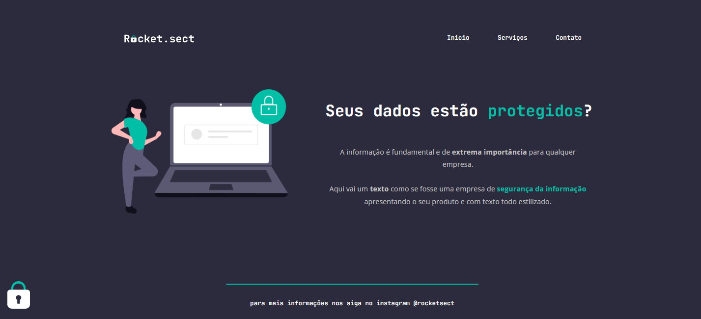

# Desafio avançado - Recriando layout
## 💻 Sobre o desafio

Nesse desafio, vou recriar uma aplicação, a partir de um layout, para treinar o que aprendi até agora no **Stage 02** do curso Explorer da Rockeseat.

## Figma da aplicação

O figma da aplicação está disponível no [**link**](https://www.figma.com/file/EdKjPWjC8ZlbnH4XzTObv2/Explorer/duplicate) abaixo:

## 🚀 Tecnologias
Esse projeto  foi desenvolvido  com as seguintes tecnologias:

-HTML
-CSS
